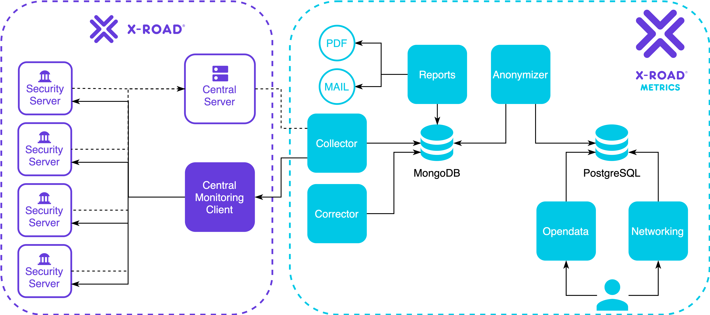

# X-Road Metrics

  

## Introduction

X-Road® Metrics is a tool for collecting, storing and analysing reporting data and metrics from an
[X-Road®](https://github.com/nordic-institute/X-Road) ecosystem. The data can be used to measure usage of individual
services, understand dependencies and relationships between different information systems and services, monitor service
health, etc. Also, the information can be published as open data.

X-Road Metrics can be used by both X-Road Operators and X-Road Members. The X-Road Operator can use X-Road Metrics to
collect data from an entire X-Road ecosystem while X-Road Members can access their own data.

The X-Road Metrics software is released under the [MIT](LICENSE.MD) open source license and is available free of
charge. The documentation is licensed under the
[Creative Commons Attribution-ShareAlike 4.0 International License](https://creativecommons.org/licenses/by-sa/4.0/).

## Architecture

The system architecture is described in the [System Architecture](./docs/system_architecture.md) document.

## Installation instructions

### Installing/setting up the Mongo Database (MongoDB)

The **first thing** that should be done is setting up the MongoDB.
Instructions on setting up the MongoDB can be found in the [Database Module](./docs/database_module.md) document.

### Module installation precedence

The modules should be set up in the following order:

 - [Database module](./docs/database_module.md)
 - [Collector module](./docs/collector_module.md)
 - [Corrector module](./docs/corrector_module.md)
 - [Reports module](./docs/reports_module.md)
 - [Anonymizer module](./docs/anonymizer_module.md)
 - [Opendata module](./docs/opendata_module.md)
 - [Networking/Visualizer module](./docs/networking_module.md)
 - [Opendata Collector module](./docs/opendata_collector_module.md)

## Programming language

All modules, except Networking, are written in [**Python**](https://www.python.org/)&trade; and tested with version 3.8
Other 3.x versions are likely to be compatible, give or take some 3rd party library interfaces.
Networking module is written in [**R**](https://www.r-project.org/).

## How to contribute?

[Sign up](https://id.atlassian.com/signup) for an account and
get access to the
[X-Road Metrics Backlog](https://nordic-institute.atlassian.net/jira/software/c/projects/OPMONDEV/boards/2/backlog).

Follow the [developer's guide](./docs/dev_guide/developer_guide.md) to setup your local development environment

Submit a pull request to
[X-Road Metrics source code Github repository](https://github.com/nordic-institute/X-Road-Metrics)
or an enhancement request to the
[ideas category under discussions](https://github.com/nordic-institute/X-Road-Metrics/discussions/new?category=ideas).

When opening a pull request, please provide a signed Contributor Licence Agreement (CLA). More information can be found
[here](https://github.com/nordic-institute/X-Road/blob/develop/CONTRIBUTING.md#legal-notice).

## Support disclaimer

The following activities, among others, are undertaken by the
[Nordic Institute for Interoperability Solutions (NIIS)](https://www.niis.org/)
with regard to X-Road Metrics:

* management, development, verification, and audit of the source code
* administration of documentation
* administration of business and technical requirements
* conducting development
* developing and implementing principles of licensing and distribution
* providing second-line support for the NIIS members
* international cooperation.

[X-Road Technology Partners](https://x-road.global/xroad-technology-partners) are enterprises providing X-Road
consultation services, e.g. deploying independent X-Road instances, developing X-Road extensions and X-Road-compatible
services, integrating informations systems with X-Road etc.

No support for X-Road Metrics deployment is provided here.

## Credits

* X-Road Metrics was initially developed by:
  [STACC (Software Technology and Applications Competence Center)](https://www.stacc.ee/en/) according to procurement
  [RHR 183990](https://riigihanked.riik.ee/register/hange/183990)
* In 2020 it was agreed that [Nordic Institute for Interoperability Solutions (NIIS)](https://www.niis.org/) takes
  maintenance responsibility.
