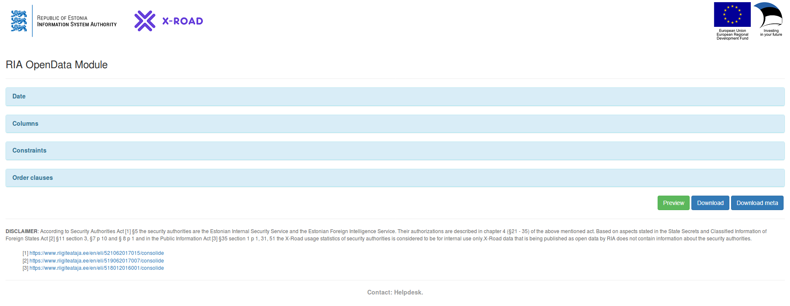

|  |  |
| :-------------------------------------------------- | -------------------------: |

# X-Road Metrics - Open Data Interface User Guide

The project maintains X-Road log of service calls (queries), published as opendata.

X-Road Metrics collects X-Road operational monitoring data from X-Road members' Security Servers available 
and publishes it as opendata with a delay of 10 days from actual transaction execution time.

Data is fetched nightly, between 0:00-6:00 (EET UTC+2h / EEST UTC+3h).

Logs are anonymized, ie sensitive fields are removed, incl:

- monitoringDataTs: The Unix timestamp in seconds when the record was received by the monitoring daemon
- securityServerInternalIp: Internal IP address of the Security Server
- messageUserId: Personal code of the client that initiated the request
- messageIssue: Client's internal identifier of a file or document related to the service
- messageId: Unique identifier of the message
- clientSecurityServerAddress: External address of client's Security Server (IP or name)
- serviceSecurityServerAddress: External address of service provider's Security Server (IP or name)

Timestamps (specifically *requestInTs*) are rounded to hour precision and presented in form of Unix timstamp (epoch time).

Additional calculations from timestamps available are made:

- requestInDate - human-readable date presentation of timestamp requestInTs
- producerDurationProducerView - when available, then calculated as substraction 'Producer responseOutTs (6)' - 'Producer requestInTs (3)'
- totalDuration - when available, then calculated as substraction 'Client responseOutTs (8)' - 'Client requestInTs (1)'

Explanation of timestamps (1) - (8):

## License <!-- omit in toc -->

This document is licensed under the Creative Commons Attribution-ShareAlike 4.0 International License.
To view a copy of this license, visit <https://creativecommons.org/licenses/by-sa/4.0/>

## Initial page

Point your browser to the HTTPS URL where you installed [X-Road Metrics opendata module](../../opendata_module.md) and 
you should see the following page:

## Date constraint

Click on the **Date** section and it should show 

The dataset is available from the moment it was available by X-Road members and collected by RIA for ecosystem monitoring purposes. Those dates are selectable.

After selecting date (sample: September 19, 2017) and clicking on the green "Preview" button, we should see both of the entries from the day:

## Column constraints

When we change the date to (sample: September 20, 2017) and select "id" and "totalDuration"

 
after clicking "Preview" again, we should see
 

## Value and order constraints

When ignoring entries with "None" value and requesting only entries with "id" greater than 10 and ordering by ascending "totalDuration"

we should see:

## Downloading

When clicking on "Download" instead of "Preview", the browser should initiate a file download. The contents should look similar to

